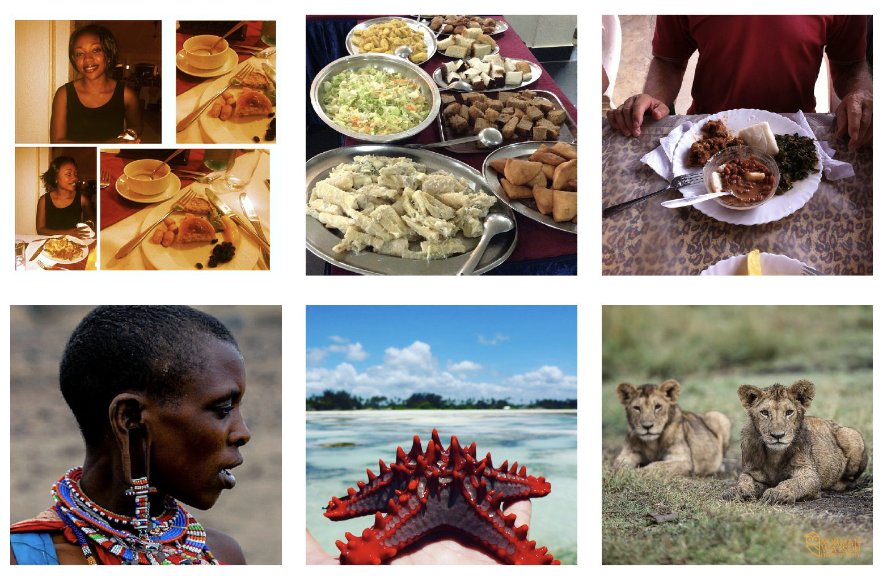

# Scraping Social Media Photos Posted in Kenya and Elsewhere to Detect and Analyze Food Types

M. Jalal*, K. Wang*, J. Sankara, Y. Zheng, E. O. Nsoesie, and M. Betke. [Scraping Social
Media Photos Posted in Kenya and Elsewhere to Detect and Analyze Food Types](https://dl.acm.org/doi/10.1145/3347448.3357170). 
published in MADiMA 2019, the 5th International Workshop on Multimedia Assisted Dietary
Management. In conjunction with the 27th ACM International Conference on Multimedia
(ACMMMM 2019) Nice, France, October 21, 2019. 10 pages.


## Kenyan food/non food dataset




Kenyan104K dataset: https://www.dropbox.com/scl/fi/ie3ddguh06t0uxkqlmfln/KFD.zip?rlkey=vt4xzclx5y1im7433b9vqlv9r&dl=0

## Kenyan Food Type Dataset (KenyanFood13)


KenyanFood13 dataset: https://www.dropbox.com/scl/fi/hk1llnnv6bpjw153epfxo/Food13.zip?rlkey=o7iq83g4g0xjeif45ibxd9kkb&dl=0


Link to ArXiv paper: https://arxiv.org/abs/1909.00134 


## Funding
This research was partially funded by the following awards:

- [NSF Award #1838193](https://www.nsf.gov/awardsearch/showAward?AWD_ID=1838193&HistoricalAwards=false) BIGDATA: IA: Multiplatform, Multilingual, and Multimodal Tools for Analyzing Public Communication in over 100 Languages

- Hariri Institute for Computing and Computational Science & Engineering at Boston University

## Credits/Authors
Kaihong Wang*, Mona Jalal*, Jefferson Sankara, Yi Zheng, Elaine Nsoesie, Margrit Betke

## BibTeX for Citing

```
@inproceedings{JalalWaJeZhNsBe19,
  title={Scraping social media photos posted in Kenya and elsewhere to detect and analyze food types},
  author={Jalal, Mona and Wang, Kaihong and Jefferson, Sankara and Zheng, Yi and Nsoesie, Elaine O and Betke, Margrit},
  booktitle={Proceedings of the 5th International Workshop on Multimedia Assisted Dietary Management},
  pages={50--59},
  year={2019}
}
```


## Acknowledgement
We are grateful to [Shuai Wei](https://www.google.com/url?sa=t&rct=j&q=&esrc=s&source=web&cd=1&cad=rja&uact=8&ved=2ahUKEwijteWTqK_mAhVwkeAKHZdqB84QFjAAegQIARAB&url=https%3A%2F%2Fwww.linkedin.com%2Fin%2Fshuai-wei-3b75322a&usg=AOvVaw1-qlowbvWpZBuH40L7Vkrt) for extensive support on getting to run our code work on SCC as well as helping us with various troubleshooting for both our PHP-based scraping and DNN codes. Shuai can be reached at shwei@bu.edu


## TODO

- [ ] Adding the 5 fold cross-validation folders for Kenyan food/non-food classifier as well as Kenyan Food Type Recognizer in Google Drive

- [ ] Adding documentation how to run the scraping script with a minimal example for both hashtag-based as well as location-based scenarios.

- [ ] Adding documentation for running the Kenyan Food/Non-Food Classifier as well as Kenyan Food Type Recognizer both in Shared Cluster Center (SCC@BU) as well as on a Deep Learning station.

- [ ] Adding a requirement.txt that shows all the necessary packages for this project.


